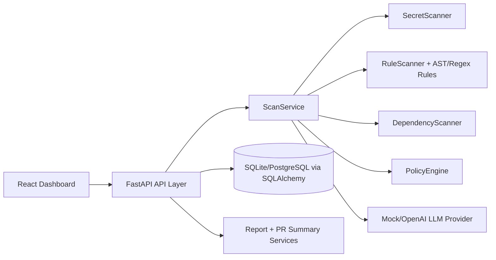

# Architecture

## Components
- Intake: repository path, diff text, webhook simulation payload.
- Detection: deterministic rule engine + secret regex + entropy + dependency indicators.
- Classification: category-weighted policy engine with confidence normalization.
- Output: findings, PR comments, merge recommendation, report export.

## Risk Enrichment
- Findings include CWE identifiers and friendly CWE titles for triage context.
- Policy classification computes a CVSS-like score (0.0-10.0) and qualitative level to prioritize remediation.
